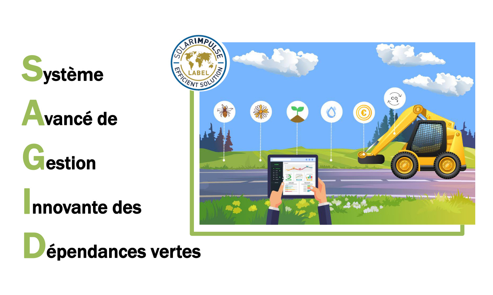

---
# Page title
title: My page
# Page type - we want a landing page (such as a homepage)
type: landing
sections:
- block: markdown
  id: banner
  content:
    title: SAGID+
    subtitle: Soutien aux métiers d’Accoroutiste à travers une Gestion Intégrale et Durable des dépendances vertes      
  design:
    columns: '1'
    background: 
      image: 
        filename: Banner.jpg
        filters:
          brightness: 0.8
        size: cover
        position: center  
        parallax: false
        text_color_light: true
- block: about.biography
  id: sagid
  content:
    title: Les bords de route
    username: sagid
- block: markdown
  content:    
    title: Qu'est que SAGID Propose?
    text:   
- block: markdown
  content:    
    title: La chaire SAGID+
    text: |-
      Cette chaire porte une attention particulière aux dépendances vertes (bords de route) et s’intéresse à la **mise en place d’une gestion durable de ces espaces végétalisés**, ayant la capacité de mitiger les impacts négatifs des routes sur la biodiversité et jouer un rôle fondamental pour son maintien. Cependant, à l’heure actuelle, les diverses parties prenantes à l’échelle d’un territoire ne disposent pas de méthodologies/modèles opérationnels leur permettant de prendre en compte et d’évaluer simultanément l’ensemble des enjeux évoqués préalablement. 

      Des études récentes ont démontré que la recherche actuelle sur la gestion des bords de route était abordée de manière fragmentée et disciplinaire. Elles ont également mis en évidence un manque de modèles formels permettant la prise en compte de la complexité d’un tel système et l’intégration des données provenant de sources et de disciplines diverses.

      > L’objectif global de la chaire est de développer des outils et méthodes dits « clés en main » capables d’évaluer la durabilité des pratiques mises en œuvre lors du processus de décision soutenus par l’intelligence artificielle, pour ensuite contribuer à l’intégration du métier dans les filières de la bioéconomie et à l’évolution des comportements écoresponsables.
  design:
    columns: '2'

- block: markdown
  content:    
    title: Quelles sont les objectifs?    
  design:
    columns: '1'
    spacing:
      padding: ["80px", "0", "20px", "0"]    
- block: markdown    
  design:
    columns: '1'    
    spacing:
      padding: ["0px", "0", "250px", "0"]
    background: 
      color: 'white'
      image: 
        filename: Territoire.jpg
        size: contain
        parallax: false

- block: markdown
  content:    
    title: "**Scientifiques**"
    text: |-
      1. Améliorer les performances économiques, environnementales et socio-territoriales des bords de route
      2. Soutenir des comportements écoresponsables en termes de gestion des bords de route
      3. Intégrer le métier d’accoroutiste dans les filières de la bioéconomie
  design:
    columns: '2'
    spacing:
      padding: ["80px", "0", "20px", "0"]    
- block: markdown
  content:    
    title: "**Opérationnels**"
    text: |-
      1. Renforcer les connaissances sur les bords de Route.
      2. Développer des outils et méthodes capables d’évaluer la durabilité des pratiques de gestion des bords de route.
      3. Accompagner la gestion et l’action publique en faveur des bords de route.
  design:
    columns: '2'
    background: 
      color: 'white'
    spacing:
      padding: ["80px", "0", "20px", "0"]  

- block: features
  content:
    title: Axes de Recherche
    subtitle: Le projet est structué autour de 4 axes
    items:
      - name: Évaluation des services écosystémiques rendus par les bords de route        
        icon: Icon-ES
        icon_pack: custom
      - name: Nouveaux outils d’orientation stratégique et d’accompagnement à la prise de décision
        icon: Icon-Bio
        icon_pack: custom
      - name: Intégration dans les nouvelles filières de la bioéconomie
        icon: Icon-Strategy
        icon_pack: custom
      - name: Accompagnement des territoires dans l’évolution des pratiques
        icon: Icon-Pedagogy
        icon_pack: custom        

- block: markdown
  content:    
    title: "Avec le Soutien"
    text: |-
      Le projet SAGID+ est cofinancé par l’Union Européenne avec le Fonds Européen de Développement régional à hauteur de 409 500 €, par le groupe ACTIBAC et la Métropole du Grand Nancy. Il contribue à l’ambition collective « Des Hommes et Des Arbres, les racines de demain », labellisée Territoire d’Innovation. Il a également obtenu la labellisation « Solar Impulse Efficient Solution Label »
    
- block: markdown    
  design:
    columns: '1'    
    spacing:
      padding: ["0px", "0", "250px", "0"]
    background: 
      color: 'white'
      image: 
        filename: funding.png
        size: contain
        parallax: false

- block: markdown
  content:    
    title: "Les Partenaires"
    text: |-
      La chaire SAGID+ bénéficie de l’expertise scientifique de l’Unité de Recherche ERPI (Equipe de Recherche sur les Processus Innovatifs) de l’Université de Lorraine, de l’Unité Mixte de Recherche SILVA, sous cotutelle Université de Lorraine, AgroParisTech, INRAE, l’Unité Mixte de Recherche LORIA (Laboratoire lorrain de Recherche en Informatique et ses Applications) sous cotutelle Université de Lorraine, CNRS, INRIA et de l’ENSGSI. Elle bénéficie également de l’expertise industrielle du groupe ACTIBAC, spécialisé dans la gestion des dépendances vertes par l’intermédiaire des entreprises NOREMAT et ACCOPILOT.
    
- block: markdown    
  design:
    columns: '1'    
    spacing:
      padding: ["250px", "0", "200px", "0"]
    background: 
      color: 'white'
      image: 
        filename: Logos_Partenaires.jpeg
        size: contain
        parallax: false

---

