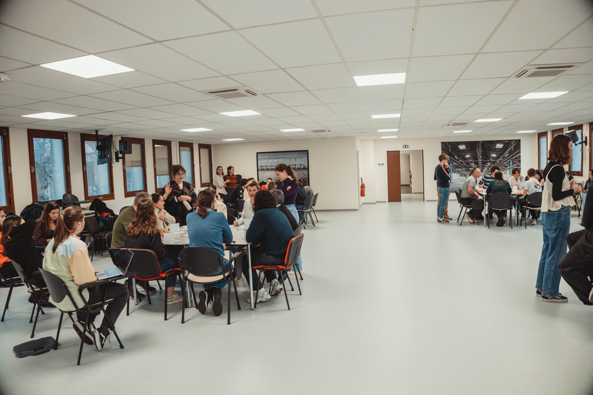

To initiate this project, the students hosted a roundtable discussion with representatives from the green spaces of the City of Nancy and the Metropolis of Grand Nancy. In parallel, exchanges with Christophe Bachmann from the ACTIBAC Group helped identify challenges related to road surroundings.  
 
Over a two-week intensive period, the students developed prototypes for awareness initiatives, which were tested on December 20th at the premises of the Terres Touloises Community of Communes. 
 
The program included a workshop inspired by the mechanics of the Climate Fresco, aimed at raising public awareness about climate change, as well as a playful role-playing game workshop. The latter aimed to encourage discussions on the management of road surroundings.

The first workshop adopted a participatory and educational approach, seeking to raise participants' awareness of the challenges of managing green dependencies. It sparked collective awareness by highlighting the connections between management decisions and the consequences of road surroundings. This shed light on stakeholders and initiated an initial exchange regarding perceptions.

In addition, the students designed a second workshop accompanied by a role-playing game that they created entirely, including game mechanics, board, and cards. Its objective was to stimulate discussions on actions to be taken and illustrate their impacts on both individual issues (elected officials, road users, residents, managers of green dependencies, etc.) and collective issues, represented by externalities. This approach aimed to help all stakeholders understand the systemic nature of road surroundings management. 
 
These workshops were enriched by exchange sessions with invited stakeholders, thereby improving these prototypes. 
 
We thank the students for their commitment and proposals, as well as the Metropolis of Grand Nancy, the City of Nancy, the ACTIBAC Group, the NOREMAT company, and the Terres Touloises Community of Communes for their valuable contribution.

