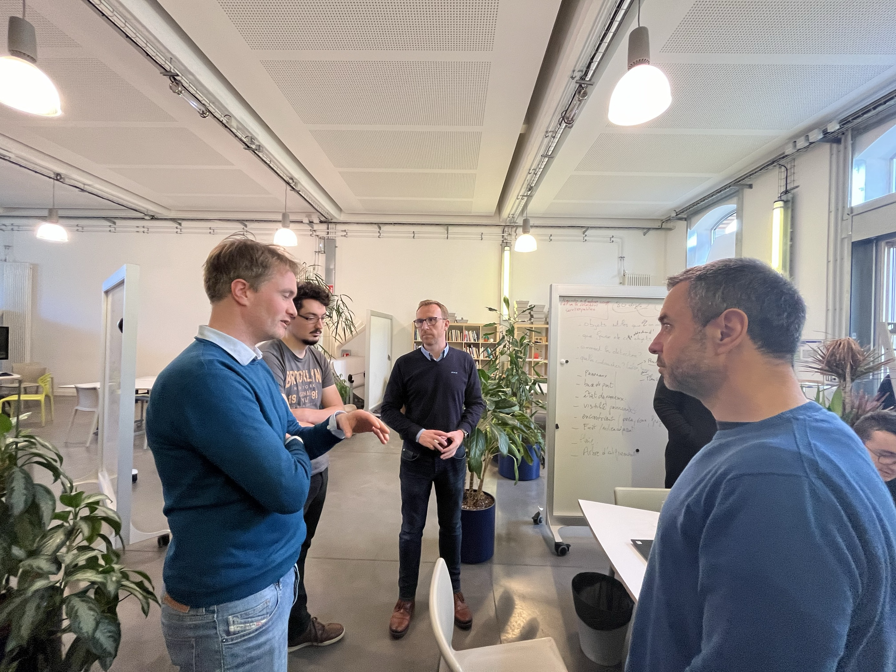
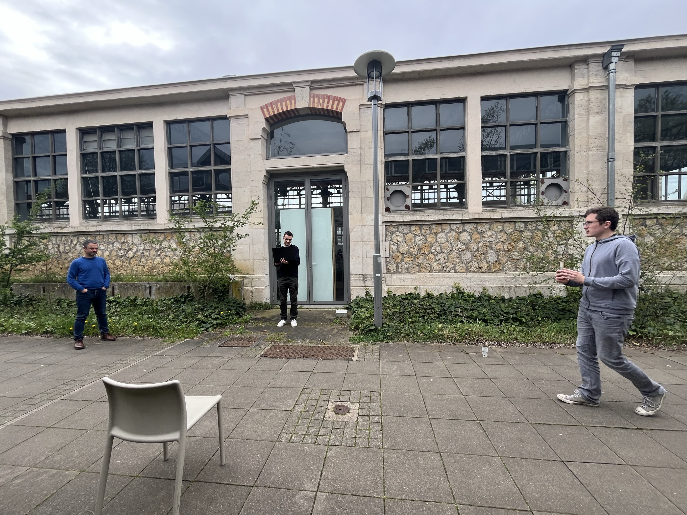

Over two days, students from Telecom Nancy applied their skills to advance discussions on intelligent territory management, particularly focusing on roadsides. Under the guidance of Laurent Dupont (research engineer - ENSGSI - ERPI (UL)) and Didier Grimaldi (researcher at La Salle University in Barcelona), eight students delved into the topic of "Smart Territory" through the SAGID+ case study.

Taking advantage of the LF2L collaborative space, three working groups were formed to address three different themes within this short timeframe:

Data collection from expert organizations (e.g., OFB, IGN, etc.) or through reports (farmers, residents, etc.)
Data exploitation, functionalities aimed at users
Image recognition using artificial intelligence

Sébastien Demange, the digital director of the Actibac group, came to share his expertise with the students on these topics.

The students were able to test their artificial intelligence image recognition algorithm in outdoor conditions. The initial results are encouraging and could lead to further work.

A presentation of all the work will take place at the end of April, and the objective for the students will be to present a coherent set of ideas.