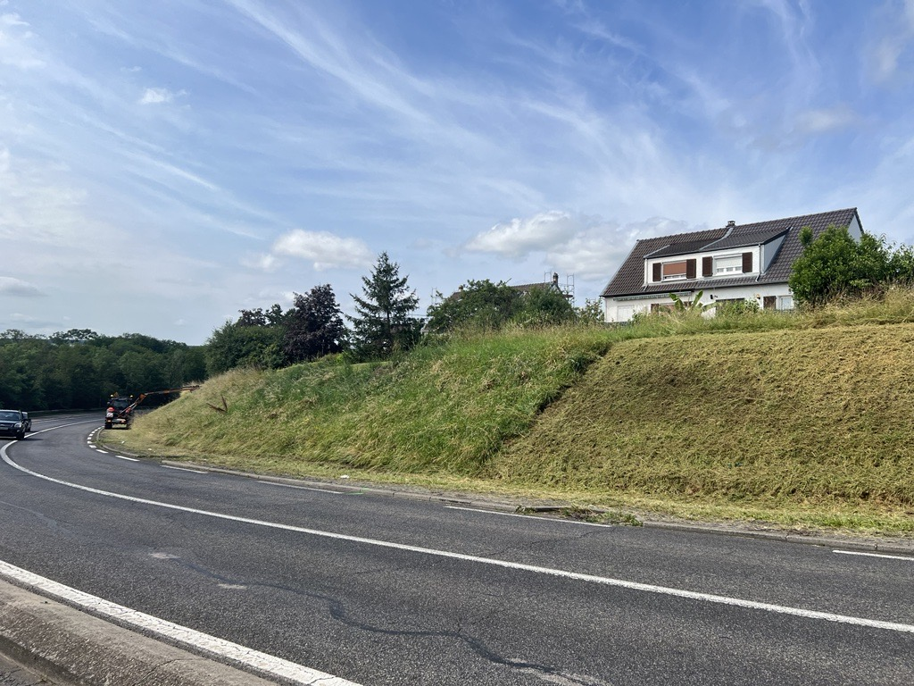

As part of the SAGID+ research project, involving the University of Lorraine and the company NOREMAT, the Métropole du Grand Nancy is participating in experiments concerning the implementation of new mowing techniques.

This morning, the enterprise Orme Paysage carried out alternating mowing for the Metropole in the commune of Ludres, on the Mirecourt Road.

This alternation between mowed and unmowed zones, each about 50 meters, allows for the maintenance of areas that can serve as refuges for biodiversity throughout the year.
The unmowed areas today will be mowed in late September in the fall.
Next year, the mowing dates for the different zones will be reversed.

Three other experimental sites are planned for 2025 in Malzéville, Essey, and Jarville.
A monitoring of pollinator insect populations will be conducted in certain areas to measure the impact of these new practices on these populations.