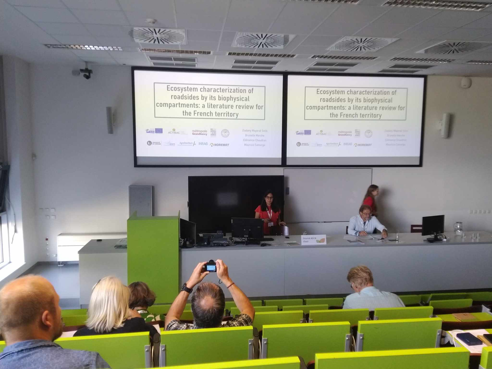
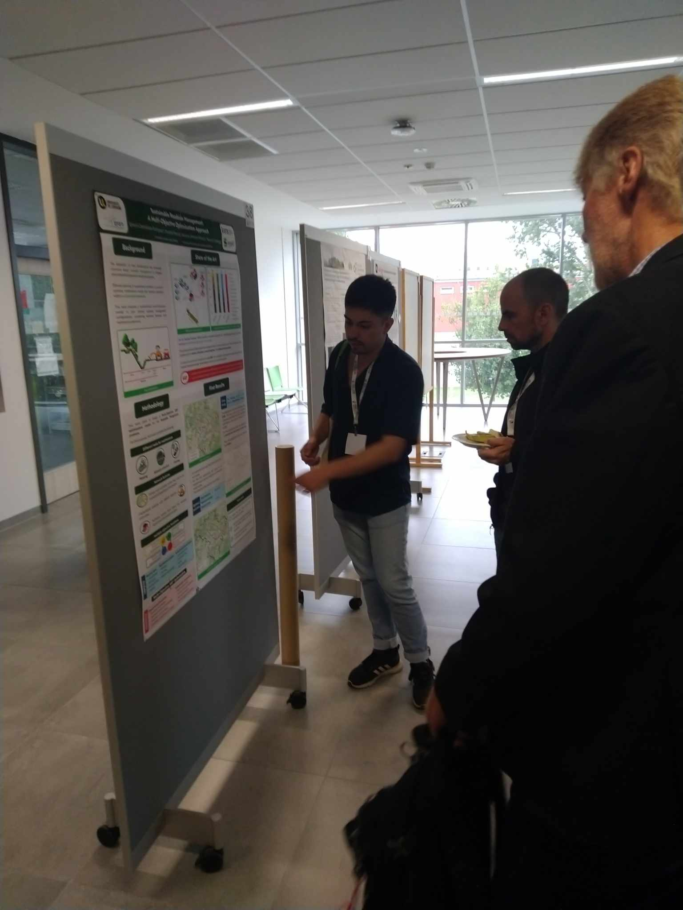

The IENE (Infrastructure and Ecology Network Europe) conference held in Prague was a great opportunity to present the project's progress and goals to the European community. Ziadany, Ignacio, Mauricio, and Brice traveled to Prague for a week to attend various presentations and showcase the project's initial results.

The week began on Sunday with a course titled "Road vegetation over time: from the first rows of trees to biodiversity conservation," led by Eva Ditlevsen and Mats Lindkvist from Swedish local authorities, and Denis François from Gustave Eiffel University, who is already well-known to the team. The day allowed us to trace the evolution of roadside maintenance practices over time and learn more about how the Swedish authorities operate, as well as about specific maintenance practices and management tools. The small number of participants in this course enabled in-depth discussions with the instructors and other attendees.

Throughout the week, everyone had the opportunity to present the work carried out within the framework of the SAGID+ chair.

This started on Tuesday afternoon with Ziadany's presentation on the characterization of roadsides as ecosystems.

Brice then presented the results obtained from the 2022 survey conducted with French departments. This also provided an opportunity to outline the project's goals and raise awareness within the community.

Following this, Ignacio had the chance to present his poster on the multi-approach optimization of roadside maintenance activities during a session where attendees could walk around and discuss the work presented.

In addition to our presentations, we had the opportunity to attend numerous highly interesting talks on a variety of topics. We learned, for example, about the joint work conducted by INRAE and SNCF on the use of tarping to control Japanese knotweed, experiments in Sweden on biomass collection, and the development of an artificial intelligence system for plant species recognition in Denmark.

The many discussions we had allowed us to meet researchers and local stakeholders facing similar challenges to ours, which could be the start of future collaborations.

