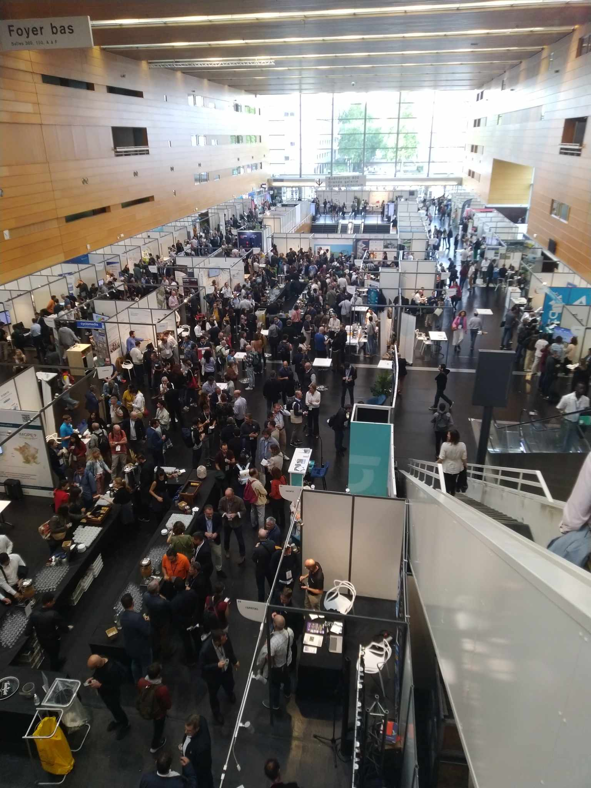

The Géodatadays, held in Nantes on September 19 and 20, provided an opportunity to gain additional knowledge and contacts in a key area for the research project.

During these two days, presentations of projects carried out at various territorial scales by companies, local authorities, and associations followed one another. We also attended roundtable discussions addressing the challenges faced by the geographic data sector. Numerous booths were set up, offering the opportunity to directly engage with organizations providing a wide range of solutions and support.

The various discussions and presentations confirmed that the issues of gathering dispersed and heterogeneous data, as well as collaborating around shared databases, are also present in other fields. It is therefore possible to learn from the experiences of those who have attempted to address these challenges.

Some presentations particularly caught our attention and could lead to future exchanges. Here are a few examples:

The SIGOGNE project, conducted by the Regional Biodiversity Agency of Bourgogne Franche-Comté to address biodiversity challenges, could provide valuable insights. Indeed, the project has already enabled the inventory of species present in the region and now offers new perspectives, such as biodiversity hotspot modeling, analysis of green and blue corridors, and the measurement of biodiversity indicators that are yet to be defined.

The development of an application to assist with monitoring legal brush-clearing obligations by the Chartreuse Regional Natural Park, which is particularly interesting in both its functionality and its relevance to our study.

The creation of a collaborative map dedicated to hedgerow monitoring by the Pays de la Loire region, which could again offer valuable information for the profession of roadside vegetation managers. This presentation introduced us to the databases used (BD Haies + regional reference system) and the key elements necessary to implement such a tool.

These two days ultimately validated the ongoing reflections within the project regarding the concept of data and helped identify potential solutions.