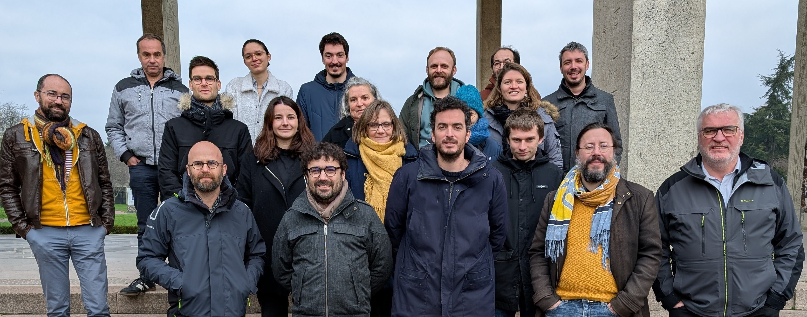

On Monday, February 10, and Tuesday, February 11, the kick-off seminar of the ANR ARHYCO project (Agricultural Roadside and HYdro-sedimentary COnnectivity) took place. As a partner project, we were invited to present the SAGID+ industrial chair and the work we are conducting.

This presentation was an opportunity to highlight the links between the two projects, both of which have strong mapping challenges. Like the SAGID+ project, the ARHYCO project also requires the definition of roadside typologies in order to map them and study them within their environment while considering their configuration.

The ARHYCO project has strong expertise in spatial data processing, which will undoubtedly bring new perspectives to the field of roadside management.

The project aims to work directly in the field by studying several sites distributed across four different departments: Calvados, Côtes-d'Armor, Rhône, and Seine-Maritime. This distribution will allow for the study of different landscapes.

A big thank you to Romain Reulier, the project coordinator, for inviting us to participate in these opening days and contribute to the project.

