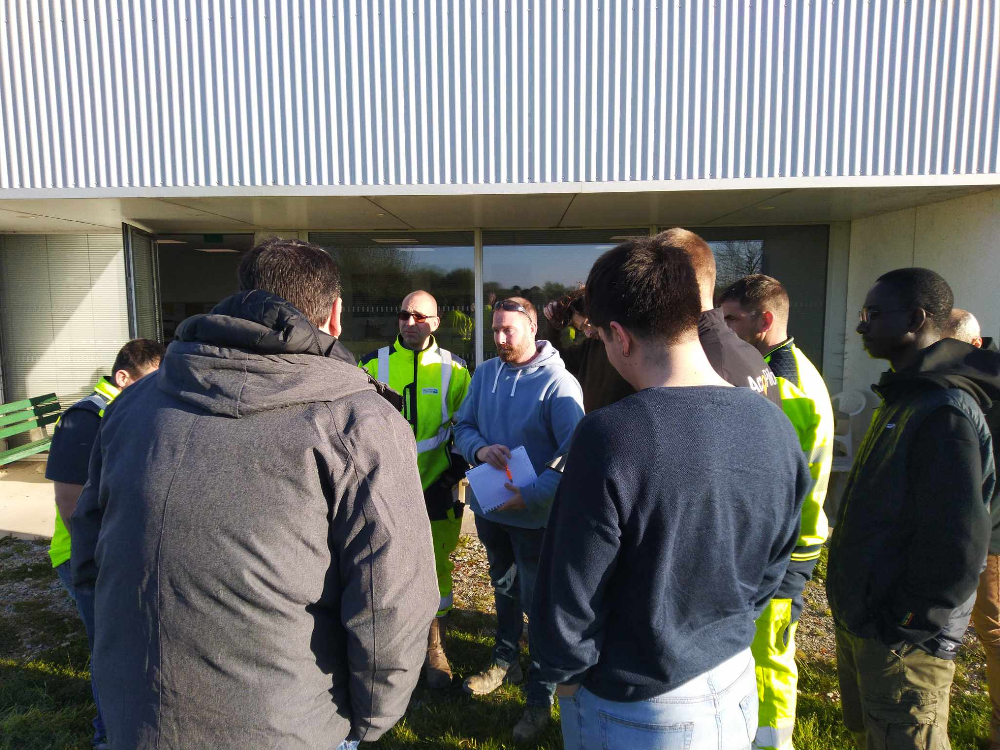

At the beginning of this week, Aly, Brice, Ignacio, and Mathias traveled to Saint Brieuc as part of the ongoing collaboration between the project and the Departmental Council of Côtes d'Armor, which has been in place for several years.

A trip to Brittany with several objectives:
- Collecting information on the business process from field agents to support the research work.
- Launching the data collection of work sites using the AccoPilot solution. The goal of this collection is to gather as much data as possible on maintenance sites, especially the time spent on these activities, in order to integrate this data into the evaluation models developed as part of the project.
- Presenting the project to the Directorate of Infrastructure and Mobility.

Tuesday's day began at the Trévé operations center (Loudéac departmental branch). Starting at 8 a.m., the AccoPilot solution was presented to the road maintenance agents and team leaders, who were already familiar with the SAGID+ approach due to their prior involvement in the project. Lucas Marchal, AccoPilot's sales representative, led the insightful discussions on how the app can provide usable data for the project. The department's agents showed strong interest in the solution and immediately recognized the potential benefits for their work, particularly with regard to detecting obstacles hidden by vegetation. The morning concluded with exchanges between the SAGID+ team and the agents to understand and incorporate their working methods into the discussions, especially in relation to the thesis work being carried out.

The afternoon followed the same pattern with a similar exchange at the Plancoët operations center. A presentation of AccoPilot was given by our team, along with an introduction to the project for agents who were unfamiliar with it, but still eager to contribute.

As part of this study, the SAGID+ chair provides the Departmental Council with four tablets, each equipped with an AccoPilot license, to record information regarding the work carried out during the year.

Wednesday's day took place at the headquarters of the Departmental Council, where the team was able to exchange ideas in the morning with Frédérique Morin, the reference for sustainable management of green and blue dependencies, our main contact at the Departmental Council, who welcomed us and helped organize this field trip. The discussions focused on how service levels are defined and how their impacts are assessed.

Finally, the trip concluded with a project presentation meeting to the Directorate of Infrastructure and Mobility. This presentation was an opportunity to review the collaboration with the Departmental Council of Côtes d'Armor, which has been ongoing for about two years, and to present the objectives of this collaboration for the coming months. Thanks to this meeting, we were able to confirm the interest in the ongoing work and the targeted tools.

A big thank you to all the agents of the Departmental Council of Côtes d'Armor for their warm welcome and for sharing their professional experiences, which are essential for ensuring that the project yields useful results for local authorities. A special thanks to Frédérique Morin for her unwavering commitment to the SAGID+ project and for enabling us to meet her colleagues during these two days.
