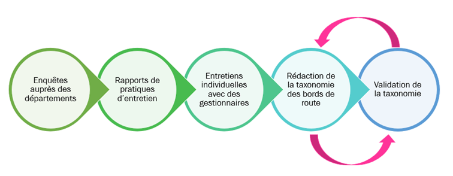

As part of Axis 1 of the SAGID+ Chair, dedicated to evaluating the ecosystem services provided by roadsides, we are tackling the assessment of the impact of maintenance practices on these services.

This evaluation will take the form of a large-scale expert survey, scheduled to begin in early 2026. We have chosen to focus the survey on five ecosystem services: soil health maintenance, biodiversity preservation, water cycle and quality maintenance, fire risk regulation, and invasive species control.

To assess the impact of maintenance practices, we will build on both the methodology and the platform developed as part of the Puzzling Biodiversity project, led by the French National Museum of Natural History, with whom we will formalize a collaboration.

The first step in carrying out this survey is to create a taxonomy of maintenance practices. A taxonomy is a logical and comprehensive classification of practices. Its structure is as follows:

Each practice is broken down into decisions. Decisions are the parameters on which managers can act and make adjustments. Each decision then involves a number of alternatives. These alternatives represent and cover the full range of possibilities available to managers in their decision-making.

To develop this work, we first relied on the results of our previous surveys to build an initial version of this taxonomy. Then, to ensure that the taxonomy accurately reflected field realities, we interviewed subject-matter experts individually. We would like to thank Christophe Pineau (CEREMA), Frédérique Morin (CD22), and Henri-Pierre Rouault (Couesnon – Marches de Bretagne) for their contributions to improving this taxonomy. Following a synthesis of these exchanges, the resulting taxonomy was validated during a workshop that brought together four other managers: Cyrille Bacabara (CD34), Damien Faure (CD07), Florian L’Hôpital (Pays des Abers), and Frédéric Le Cam (CD76), whom we also warmly thank.

In the coming months, you will be able to contribute to the SAGID+ Chair by helping us assess the impacts of different practices.