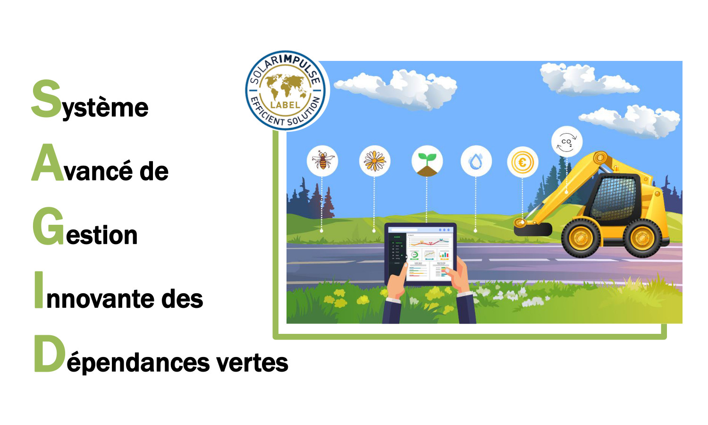

---
# Page title
title: My page
# Page type - we want a landing page (such as a homepage)
type: landing
sections:
- block: markdown
  id: banner
  content:
    title: SAGID+
    subtitle: Soutien aux métiers d’Accoroutiste à travers une Gestion Intégrale et Durable des dépendances vertes      
  design:
    columns: '1'
    background: 
      image: 
        filename: Banner.jpg
        filters:
          brightness: 0.8
        size: cover
        position: center  
        parallax: false
        text_color_light: true
- block: about.biography
  content:
    title: Les bords de route
    username: sagid
- block: markdown
  content:    
    title: Qu'est que SAGID Propose?
    text:   
- block: markdown
  content:    
    title: La chaire SAGID+
    text: |-
      Cette chaire porte une attention particulière aux dépendances vertes (bords de route) et s’intéresse à la **mise en place d’une gestion durable de ces espaces végétalisés**, ayant la capacité de mitiger les impacts négatifs des routes sur la biodiversité et jouer un rôle fondamental pour son maintien. Cependant, à l’heure actuelle, les diverses parties prenantes à l’échelle d’un territoire ne disposent pas de méthodologies/modèles opérationnels leur permettant de prendre en compte et d’évaluer simultanément l’ensemble des enjeux évoqués préalablement. 

      Des études récentes ont démontré que la recherche actuelle sur la gestion des bords de route était abordée de manière fragmentée et disciplinaire. Elles ont également mis en évidence un manque de modèles formels permettant la prise en compte de la complexité d’un tel système et l’intégration des données provenant de sources et de disciplines diverses.

      > L’objectif global de la chaire est de développer des outils et méthodes dits « clés en main » capables d’évaluer la durabilité des pratiques mises en œuvre lors du processus de décision soutenus par l’intelligence artificielle, pour ensuite contribuer à l’intégration du métier dans les filières de la bioéconomie et à l’évolution des comportements écoresponsables.

      ## **Finalités**

      1. Améliorer les performances économiques, environnementales et socio-territoriales des bords de route
      2. Soutenir des comportements écoresponsables en termes de gestion des bords de route
      3. Intégrer le métier d’accoroutiste dans les filières de la bioéconomie
  design:
    columns: '2'

---
