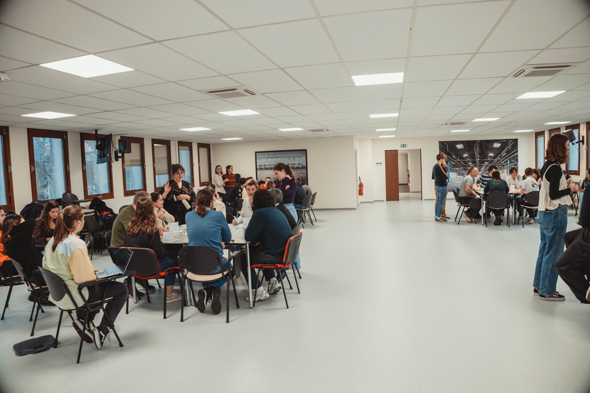

Pour amorcer ce projet, les étudiants ont animé une table ronde réunissant des représentants des espaces verts de la Ville de Nancy et de la Métropole du Grand Nancy. En parallèle, des échanges avec Christophe Bachmann du Groupe ACTIBAC ont permis de cerner les enjeux liés aux abords de route.  
 
Durant deux semaines intensives, les étudiants ont élaboré des prototypes de dispositifs de sensibilisation, soumis à des tests le 20 décembre dans les locaux de la Communauté de Communes Terres Touloises.  
 
Au programme figuraient un atelier inspiré de la mécanique de la Fresque du climat, destiné à sensibiliser le grand public au réchauffement climatique, ainsi qu'un atelier ludique sous forme de jeu de rôle. Ce dernier visait à encourager les échanges sur la gestion des abords de route.
Le premier atelier adoptait une approche participative et pédagogique, visant à sensibiliser les participants aux enjeux de gestion des dépendances vertes. Il a suscité une prise de conscience collective en mettant en lumière les liens entre les décisions de gestion et les conséquences des abords de route. Cela a permis d'éclairer les parties prenantes et d'initier un premier échange concernant les perceptions.
En complément, les étudiants ont conçu un deuxième atelier accompagné d'un jeu de rôle qu'ils ont entièrement créé, mécanisme de jeu, plateau et cartes inclus. Son objectif était de stimuler les échanges sur les actions à entreprendre et d'illustrer leurs impacts à la fois sur les enjeux individuels (élus, usagers de la route, riverains, gestionnaires des dépendances vertes, etc.) et sur les enjeux collectifs, représentés par des externalités. Cette approche visait à faire comprendre à toutes les parties prenantes la nature systémique de la gestion des abords de route.  
 
Ces ateliers ont été enrichis par des sessions d'échanges avec les parties prenantes invitées, permettant ainsi d'améliorer ces prototypes de dispositifs.  
 
Nous remercions les étudiants pour leur engagement et leurs propositions, ainsi que la Métropole du Grand Nancy, la Ville de Nancy, le groupe ACTIBAC, l'entreprise NOREMAT et la Communauté de Communes Terres Touloises pour leur précieuse contribution.  

