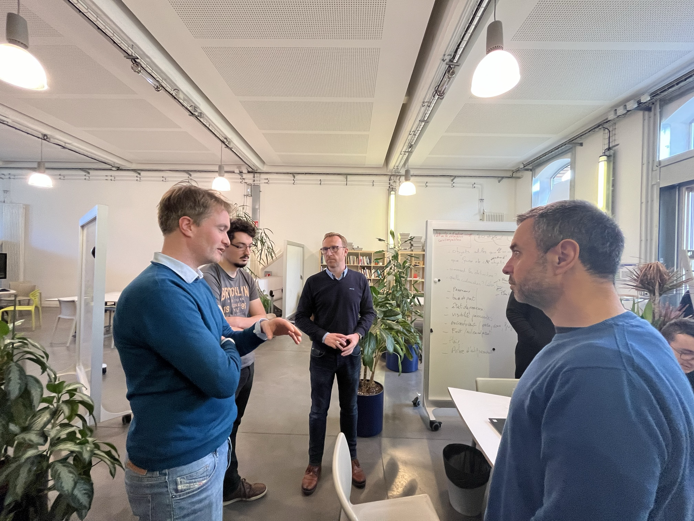
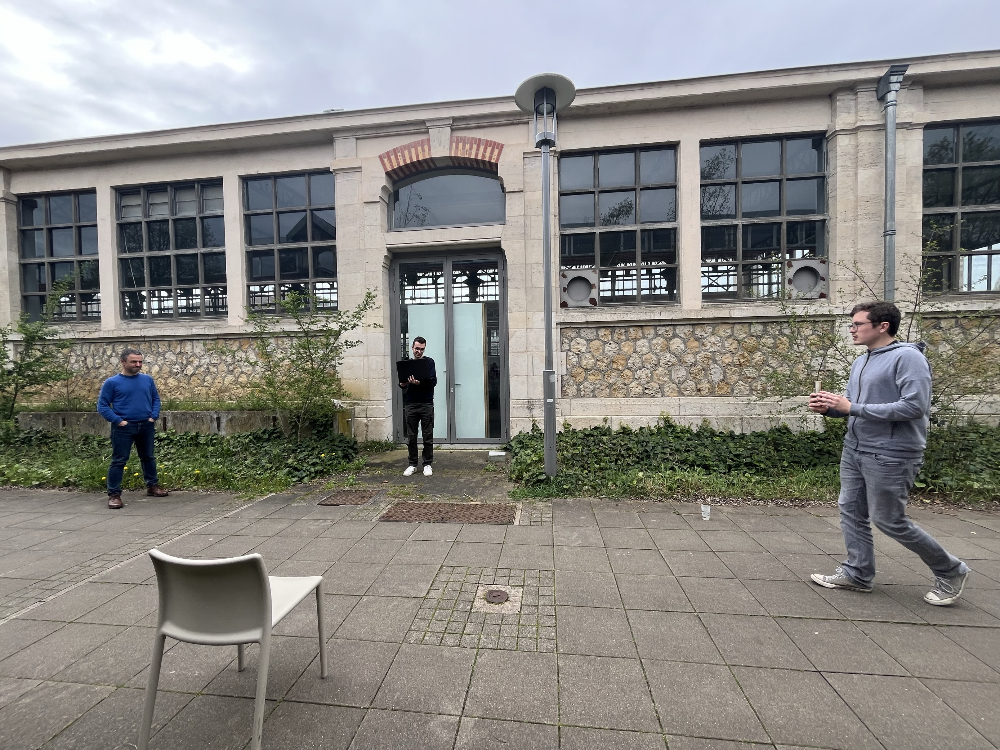

Pendant deux jours, les étudiants de Telecom Nancy ont mis leurs compétences à contribution pour faire avancer les réflexions sur la gestion intelligente du territoire et notamment des bords de route. Encadrés par Laurent Dupont (ingénieur de recherche à l'UL) et Didier Grimaldi (enseignant-chercheur à l'université de La Salle à Barcelone), huit étudiants ont en effet pu aborder le sujet de "Smart Territory" au travers du cas d'étude de SAGID+.

Profitant de l'espace Living Lab du LF2L, trois groupes de travail ont pu être créés afin d'aborder trois thématiques différentes dans ce temps très court:
- La collecte des données auprès des organismes experts (ex: OFB, IGN, etc) ou par des signalements (agriculteurs, riverains, etc)
- L'exploitation des données, les fonctionnalités à destination des utilisateurs
- La reconnaissance d'image par intelligence artificielle

Sébastien Demange, directeur digital du groupe Actibac, est venu faire profiter les étudiants de son expertise sur ces sujets.

Les étudiants ont pu testé leur algorithme de reconnaissance par intelligence artificielle en conditions extérieurs. Les premiers résultats sont encourageants et pourraient donner lieu à une poursuite des travaux.

Une restitution de l'ensemble des travaux aura lieu fin avril et l'objectif pour les étudiants sera de présenter un ensemble d'idée cohérent.