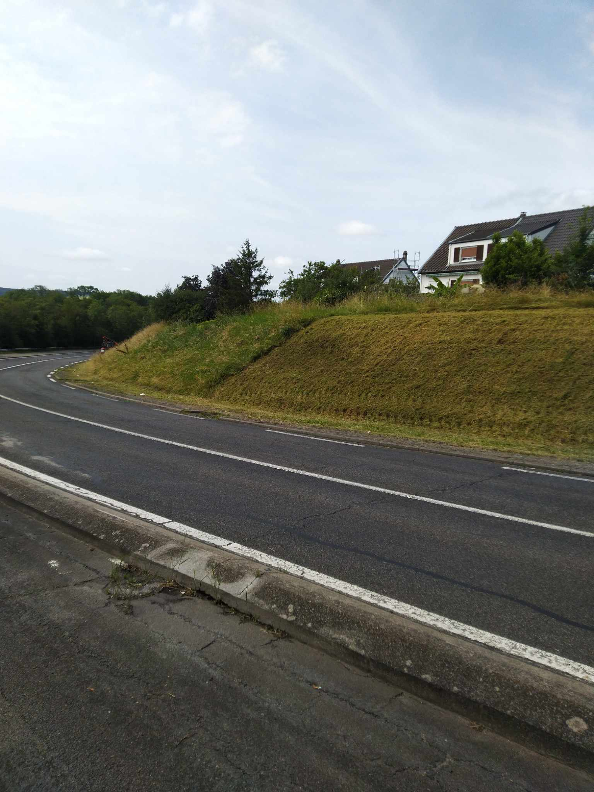

Dans le cadre du projet de recherche SAGID+, mobilisant l’Université de Lorraine et l’entreprise NOREMAT, la Métropole du Grand Nancy participe à des expérimentations concernant la mise en oeuvre de nouvelles techniques de fauchage. 

Ce matin, la société Orme Paysage a réalisé pour le compte de la métropole du fauchage alterné sur la commune de Ludres, route de Mirecourt.

Cette alternance entre zones fauchées et non fauchées d'environ 50m permet de garder tout au long de l'année des zones qui peuvent fournir un refuge pour la biodiversité. 
Les zones non fauchées aujourd'hui le seront à l'automne fin septembre. 
L'année prochaine, les dates de fauche des différentes zones seront inversées.

Trois autres sites d'expérimentation sont prévus pour l'année 2025 à Malzéville, Essey et Jarville.
Un suivi des populations d'insectes pollinisateurs sera effectué sur certains secteurs afin de pouvoir mesurer l'impact de ces nouvelles pratiques sur ces populations.