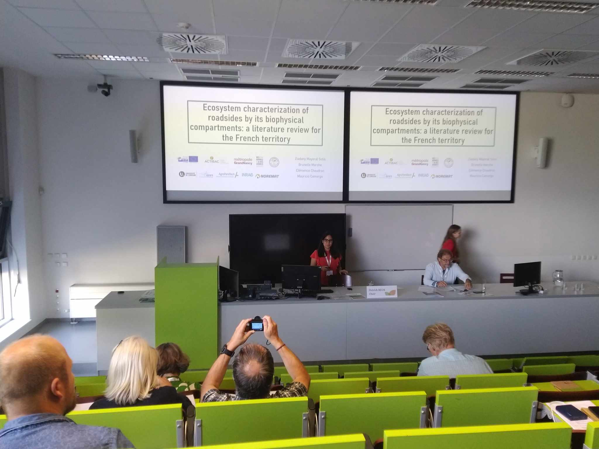

La conférence IENE (Infrastructure and Ecology Network Europe) organisée à Prague était une bonne occasion de présenter les avancées et les objectifs du projet à la communauté européenne. Ziadany, Ignacio, Mauricio et Brice se sont donc rendus à Prague durant une semaine pour assister aux différentes présentations proposées et exposer les premiers résultats du projet.

La semaine a commencé dimanche avec un cours intitulé "Road vegetation over time: from the first rows of trees to the conservation of biodiversity" animé par Eva Ditlevsen et Mats Lindkvist des autorités locales suédoises et Denis François de l'Université Gustave Eiffel, déjà bien connu de l'équipe. La journée a permis de retracer l'évolution des pratiques d'entretien des bords de route au fil du temps et d'en apprendre davantage sur la manière de fonctionner des autorités suédoises ainsi que sur des pratiques d'entretien et des outils de gestion spécifiques. Le faible nombre de participants à ce cours nous a permis d'échanger en profondeur avec les animateurs et les autres participants.

Durant la semaine, chacun a eu l'occasion de présenter les travaux réalisés dans le cadre de la chaire SAGID+.

Cela a commencé mardi après-midi avec la présentation de Ziadany à propos de la caractérisation des bords de route comme écosystème. 

Brice a ensuite présenté les résultats obtenus lors de l'enquête réalisée en 2022 auprès des départements français. Cela a également permis d'exposer les objectifs du projet et de les faire connaître auprès de la communauté.

Dans la foulée, Ignacio a pu présenter son poster sur l'optimisation multi-approche des activités d'entretien des bords de route au cours d'une session où les intéressés se sont succédés.

Oûtre ces présentations, nous avons pu assister à de nombreuses présentations très intéressantes sur des sujets variés. Nous avons ainsi pu prendre connaissance du travail commun réalisé par l'INRAE et la SNCF sur le traitement par bâchage de la Renouée du Japon, des expérimentations menées par la Suède sur la collecte de la biomasse ou encore le développement d'un système d'intelligence artificielle pour la reconnaissance d'espèces végétales au Danemark entre autres.

Les nombreuses discussions que nous avons pu avoir nous ont permis de faire la connaissance de chercheurs ou d'acteurs du territoire faisant face à des problématiques similaires à celle que nous rencontrons et pourraient être le début de futures collaborations.

