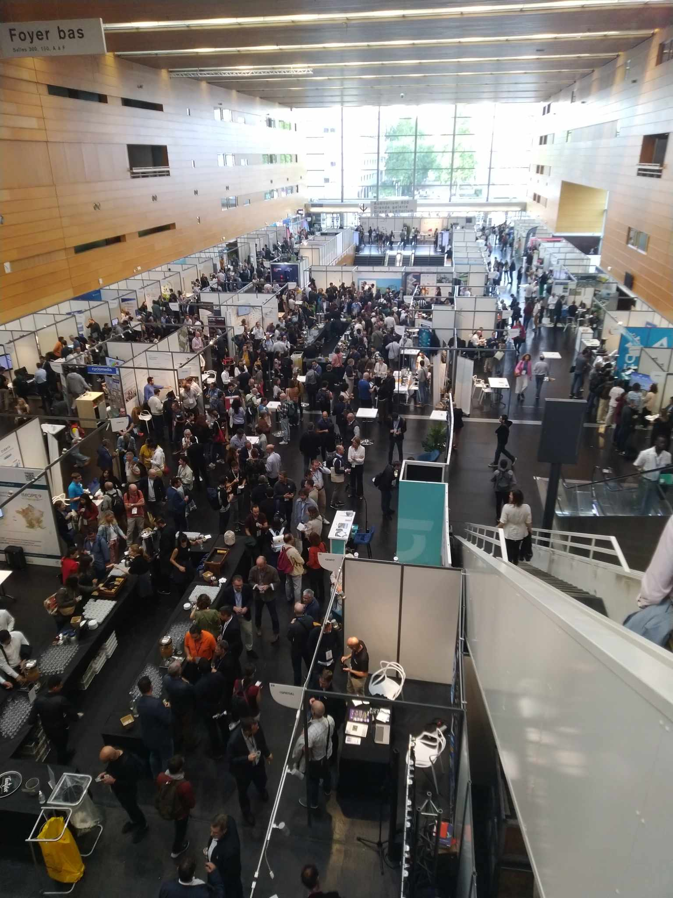

Les Géodatadays qui se sont tenus à Nantes les 19 et 20 septembre derniers étaient l'occasion d'acquérir des connaissances et des contacts supplémentaires dans un domaine clé pour le projet de recherche.

Lors de ces deux jours, les présentations de projets réalisés à différentes échelles territoriales par des entreprises, des collectivités ou des associations se sont succédées. Nous avons également pu assister à des tables rondes autour des enjeux rencontrés par le domaine des données géographiques. De nombreux stands étaient également installés avec la possibilité d'échanger directement avec des organismes proposant des solutions ou des accompagnements divers et variés.

Les différents échanges et les différentes présentations ont pu confirmer que les problématiques de regroupement de données dispersées et hétérogènes et de collaboration autour de bases de données communes sont également présentes dans d'autres domaines et qu'il est donc possible d'apprendre des retours d'expérience des personnes qui auraient essayé d'y répondre.

Certaines présentations ont pu particulièrement attirer notre attention et pourront faire l'objet d'échanges futurs, en voici quelques exemples:

- Le projet SIGOGNE réalisé par l’Agence Régionale de la Biodiversité de Bourgogne Franche Comté pour répondre aux enjeux de biodiversité pourrait fournir des éléments intéressants. En effet, le projet a déjà permis d'effectuer un recensement des espèces présentes sur le territoire et propose maintenant de nouvelles perspectives comme la modélisation de hotspots de biodiversité, l'analyse de la trame verte et bleue ou encore la mesure d'indicateurs de biodiversité qui restent encore à définir.

- La réalisation d'une application d'aide au suivi des obligations légales de débroussaillement par le Parc Naturel Régional de Chartreuse qui est particulièrement intéressante dans son fonctionnement et dans sa thématique pour notre sujet d'étude.

- La mise en place d'une carte collaborative dédiée au suivi des haies par la région Pays de la Loire qui là encore pourrait apporter de précieuses informations pour le métier d'accoroutiste. La présentation de cette initiative nous a permis de connaitre les bases de données utilisées (BD Haies + référentiel régional) mais aussi les clés pour parvenir à mettre en oeuvre un tel outil.

Ces deux jours auront finalement permis de valider les réflexions engagées dans le cadre du projet sur la notion de données et de découvrir des pistes de réponse à celles-ci.