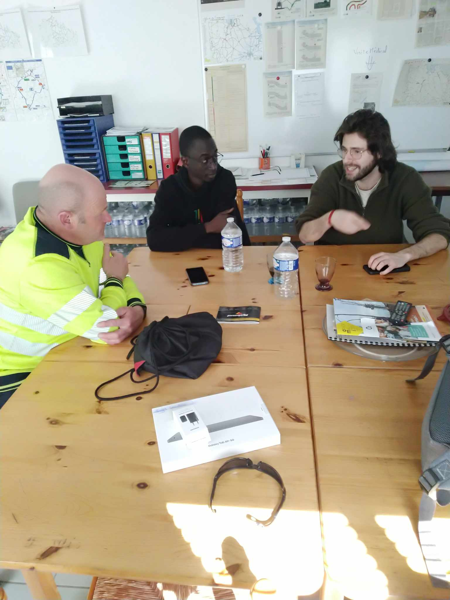

En ce début de semaine, Aly, Brice, Ignacio et Mathias se sont rendus à Saint Brieuc dans le cadre de la collaboration entretenue par le projet avec le Conseil Départemental des Côtes d'Armor depuis plusieurs années.

Un déplacement en terre bretonne avec plusieurs objectifs:
- Récolter des informations sur le processus métier auprès des agents de terrain pour alimenter les travaux de recherche
- Lancer la collecte de données de chantier réalisées avec la solution AccoPilot. L'objectif de cette collecte est de récupérer un maximum de données sur les chantiers d'entretien et notamment le temps passé pour ces activités afin de pouvoir intégrer ces données dans les modèles d'évaluation développés dans le cadre du projet.
- Présenter le projet à la direction des infrastructures et des mobilités

La journée de mardi a commencé au centre d'exploitation de Trévé (antenne départementale de Loudéac). Dès 8h présentation de la solution AccoPilot aux accoroutistes et aux chefs d'équipe déjà au fait de la démarche SAGID+ par leur implication antérieure dans le projet. Lucas Marchal, commercial d'AccoPilot, mène les échanges très riches autour de l'utilisation de l'application pour que celle-ci puisse apporter des données exploitables pour le projet. Les agents du département ont tous montré un fort intérêt pour la solution et ont tout de suite perçu les intérêts qu'ils pouvaient en tirer dans leur travail avec notamment le relevé des obstacles cachés par la végétation.
La matinée s'est conclue par des échanges entre l'équipe SAGID+ et les agents afin de découvrir et d'intégrer la manière de travailler des agents dans les réflexions menées autour des différents travaux de thèse notamment.

Rebelotte l'après-midi avec un échange du même type au centre d'exploitation de Plancoët. Une présentation d'AccoPilot effectuée par nos soins accompagnée d'une présentation du projet pour des agents qui ne connaissaient cette fois pas le projet mais toujours aussi motivés pour y contribuer. 

Dans le cadre de cette étude, la chaire SAGID+ met donc à disposition du Conseil départemental quatre tablettes disposant chacune d'une licence AccoPilot afin de pouvoir enregistrer les informations concernant les chantiers effectués sur l'année.

La journée de mercredi s'est déroulée au siège du conseil départemental où l'équipe a pu échanger le matin avec Frédérique Morin, référente gestion durable dépendances vertes et bleues, notre contact principal au Conseil Départemental, qui nous a accueilli et permis d'organiser ce déplacement sur le terrain. Les discussions ont tourné cette fois-ci autour de la manière dont les niveaux de service sont construits mais aussi comment leurs impacts sont évalués.

Enfin, le déplacement s'est conclu avec une réunion de présentation du projet à la direction des Infrastructures et des Mobilités. Cette présentation était l'occasion de faire un point sur la collaboration avec le Conseil Départemental des Côtes d'Armor qui dure depuis environ 2 ans et de présenter les objectifs des cette collaboration sur les mois à venir. Nous avons pu grâce à cette réunion obtenir la confirmation de l'intérêt des travaux menés et des outils visés. 

Un grand merci à tous les agents du Conseil Départemental des Côtes d'Armor pour leur accueil et leurs partages d'expérience autour de leur profession qui sont des éléments indispensables pour permettre au projet de déboucher sur des résultats utiles aux collectivités.
Un merci tout particulier à Frédérique Morin pour son investissement sans faille aux côtés du projet SAGID+ et pour nous avoir permis de rencontrer ses collègues pendant ces deux jours.
