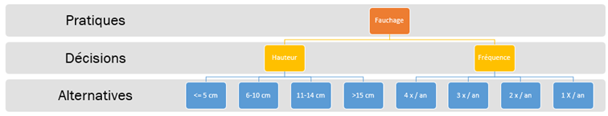

Dans le cadre de l’axe 1 de la chaire SAGID+ destiné à l’évaluation des services écosystémiques rendus par les bords de route nous nous attaquons à l’évaluation de l’impact des pratiques d’entretien sur ces services. 

Cette évaluation prendra la forme d’une large enquête auprès d’experts qui devrait débuter en début d’année 2026. Nous avons fait le choix de focaliser l’enquête sur 5 services écosystémiques: le maintien de la santé des sols, la préservation de la biodiversité, le maintien du cycle de l’eau et de sa qualité, la régulation des risques d’incendie et la régulation des invasives. 

Pour évaluer l’impact des pratiques d’entretien nous allons reprendre la méthodologie utilisée ainsi que la plateforme développée dans le cadre du projet Puzzling Biodiversity piloté par le Muséum National d’Histoire Naturelle avec qui nous allons conventionner une collaboration. 

La première étape pour pouvoir réaliser cette enquête consiste à créer une taxonomie des pratiques d’entretien. Une taxonomie consiste à classifier les pratiques de manière logique et exhaustive. La structure de la taxonomie est la suivante: 

Chaque pratique est décomposée en décisions. Les décisions sont les paramètres sur lesquels les gestionnaires peuvent agir et effectuer des modifications. Chaque décision présente ensuite un certain nombre d’alternatives. Ces alternatives représentent et couvrent l’ensemble des possibilités envisageables pour les gestionnaires dans leurs décisions. 

Pour réaliser ce travail, nous nous sommes d’abord appuyés sur les résultats obtenus lors de nos précédentes enquêtes afin de construire une première version de cette taxonomie. Puis, afin de nous assurer que la taxonomie correspondait bien à la réalité du terrain, nous avons questionné des experts du sujet en entretien individuel. Nous remercions donc Christophe Pineau (CEREMA), Frédérique Morin (CD22) et Henri-Pierre Rouault (Couesnon – Marches de Bretagne) pour leur contribution à l’amélioration de cette taxonomie. Après avoir fait la synthèse de ces échanges, la taxonomie obtenue a été validée lors d’un atelier regroupant quatre autres gestionnaires : Cyrille Bacabara (CD34), Damien Faure (CD07), Florian L’Hôpital (Pays des Abers) et Frédéric Le Cam (CD76) que nous remercions également. 

Dans les prochains mois, vous pourrez contribuer à la chaire SAGID+ en nous aidant à évaluer les impacts des différentes pratiques.  