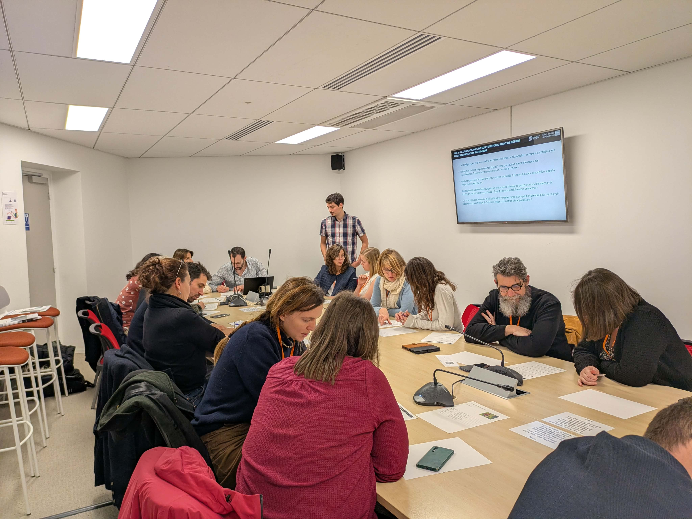
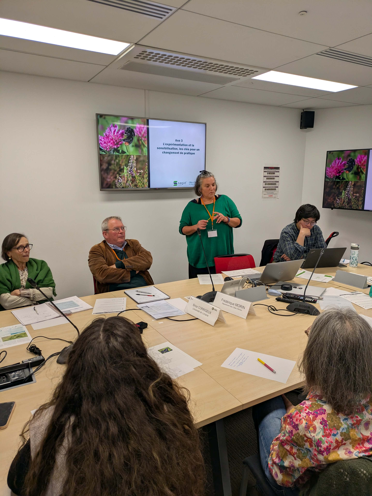

Vendredi 12 décembre, la Direction Générale des Infrastructures, des Transports et des Mobilités a organisé une journée d’échange sur le thème « Transport et biodiversité : pour une gestion durable des infrastructures de mobilités ». Cette journée a vu la participation d’une centaine de gestionnaires d’infrastructures diverses comme VNF (Voies navigables de France), la SNCF, RTE, NaTran et bien sûr des conseils départementaux et de nombreuses DIR.

La matinée a été dédiée à des partages d’expériences autour de deux tables rondes :

La première, avec comme sujet « Concilier les enjeux de sécurité et environnementaux dans la gestion des dépendances vertes » a permis à plusieurs gestionnaires de partager leurs objectifs de préservation de la biodiversité, les contraintes auxquelles ils font face et les solutions qu’ils ont trouvé pour concilier les deux.
Les trois leviers principaux pour réussir à concilier ces enjeux qui ont été relevés sont :
-	Renforcer la connaissance du terrain : il est nécessaire de connaître ses dépendances vertes afin de planifier les interventions d’entretien en fonction de leur typologie.
-	Travailler sur les calendriers d’intervention : les dates d’intervention sont le paramètre majeur sur lequel joué, il s’agit donc de trouver les fenêtre temporelle répondant le mieux aux différents enjeux.
-	Favoriser le dialogue avec les services de l’Etat : l’OFB, les DREAL sont dans un rôle d’accompagnement des gestionnaires sur ces démarches, mieux vaut les solliciter dès la définition des stratégies.

La seconde était justement axée sur la connaissance du terrain puisqu’elle s’intitulait « Les outils numériques au service de la connaissance et de la gestion durable des dépendances vertes ». Encore une fois, la parole était aux gestionnaires qui ont pu présenter leurs solutions. 
Il a été intéressant de noter que, malgré des besoins de cartographie sensiblement similaires, chaque gestionnaire a tendance à développer sa solution de son côté avec ses propres fonctionnalités. Un gestionnaire d’ENEDIS a alors fait une remarque qui va dans le même sens que notre ambition sur le sujet : il pourrait être intéressant que l’ensemble des gestionnaires intéressés se regroupent afin de travailler ensemble sur le développement d’un outil cartographique commun. 

L’après midi a été consacrée à la réalisation de 4 ateliers différents et nous avons eu la chance d’en animer un aux côtés du Conseil départemental des Côtes d’Armor en la personne de Frédérique Morin. Le sujet donné, « Quel patrimoine naturel sur les dépendances vertes ? Comment préserver les services écosystémiques rendus par ce patrimoine ? », nous a permis d’aborder les travaux engagés dans le cadre de la chaire SAGID+.

Nous avons également fait réfléchir les participants sur les stratégies qui peuvent être mises en œuvre dans le but de mieux connaître le patrimoine naturel des dépendances vertes. 

Enfin, Frédérique Morin a partagé son retour d’expérience sur le changement de pratique qu’elle pilote dans son département avec la mise en œuvre de débroussaillage tardif en damier. Le récit de cette démarche a débouché sur un échange à propos des moyens de communication et de sensibilisation à mettre en œuvre afin de faciliter l’assimilation des nouvelles pratiques, que ce soit au niveau des agents, des élus et même des usagers et des riverains.

En conclusion, chaque temps de cette journée a apporté des éléments clés en faveur de la gestion durable des dépendances vertes. Les échanges ont également validé de nombreux axes de travail engagés dans le cadre du projet puisque a notamment été rappelé l’importance de connaître son territoire grâce à la cartographie. L’évaluation de l’impact des pratiques d’entretien sur les services écosystémiques va également apporter les éléments nécessaires à une planification cohérente en faveur de l’environnement.

Nous souhaitons remercier la DGITM pour l’organisation de cet événement et pour l’invitation à animer un atelier permettant de mettre en avant les travaux de recherche que nous menons.

