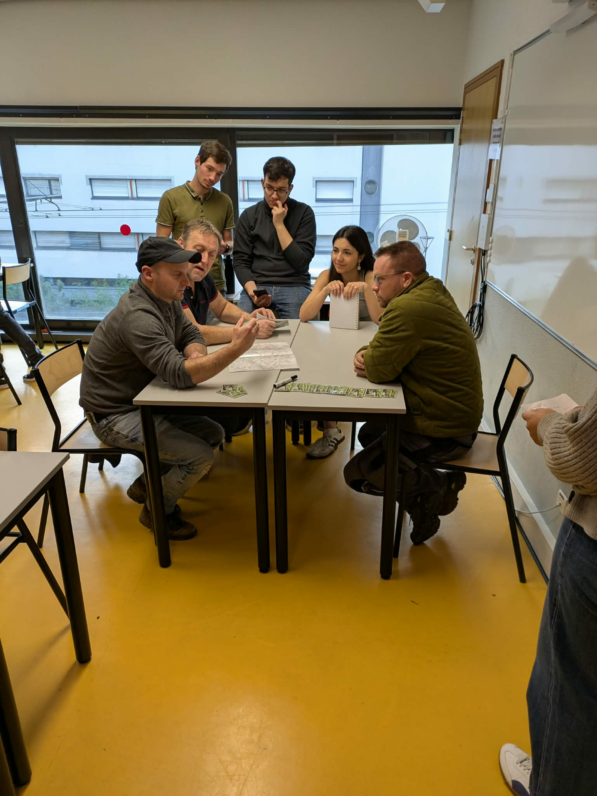
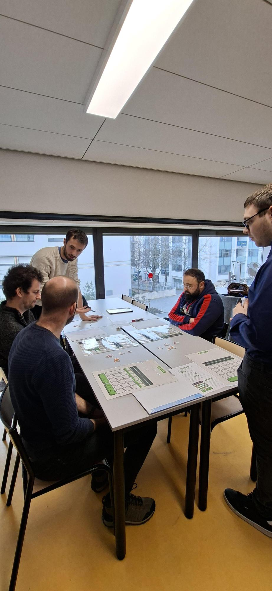
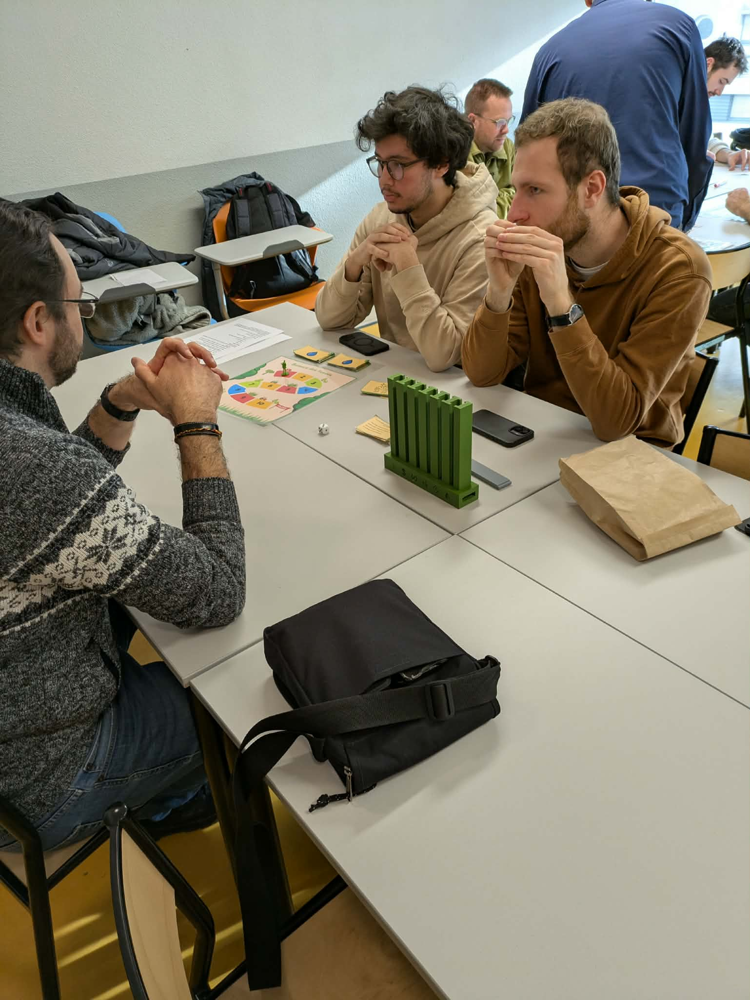

Cette année, deux groupes d’étudiants de l’ENSGSI ont l’occasion de mettre en application leurs compétences en gestion de projet et en innovation dans le cadre d’un projet industriel fourni par l’entreprise NOREMAT en lien avec la chaire SAGID+.

L’objectif des étudiants est de créer plusieurs jeux pédagogiques permettant d’alimenter une formation sur les enjeux environnementaux liés à la gestion des bords de route.

Ce vendredi, les étudiants ont pu confronter leurs premiers prototypes à la réalité grâce à la participation de plusieurs agents de la Métropole du Grand Nancy. Trois jeux durant une vingtaine de minutes chacun et traitant de trois thématiques différentes ont donc pu être testés. Les thématiques abordés sont le fauchage alterné, le curage des fossés et la valorisation de la biomasse.

Dans la bonne humeur, les agents ont pu tester chacun des 3 jeux créés par les étudiants. Les échanges entre les participants et les étudiants ont permis de déceler de nombreux points d’amélioration des différents concepts autant sur la forme que sur le fond. 

Un bilan global très positif puisque le choix de s’orienter vers des contenus ludiques a été fortement apprécié par les agents qui se sont laissés prendre au jeu. 

La matinée ayant été couronnée de succès, il se pourrait bien que la formule soit reproduite en clôture de projet avec la version finale des jeux. 
