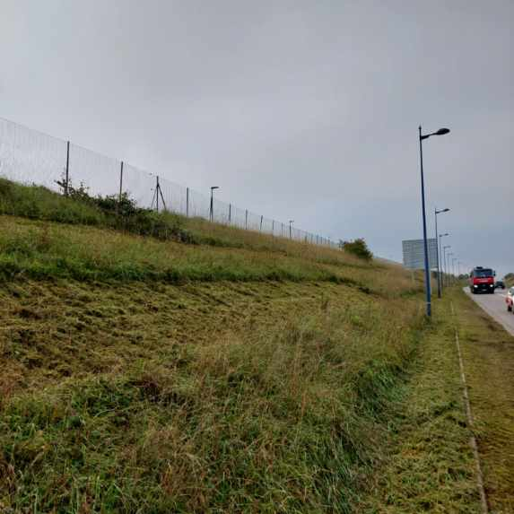
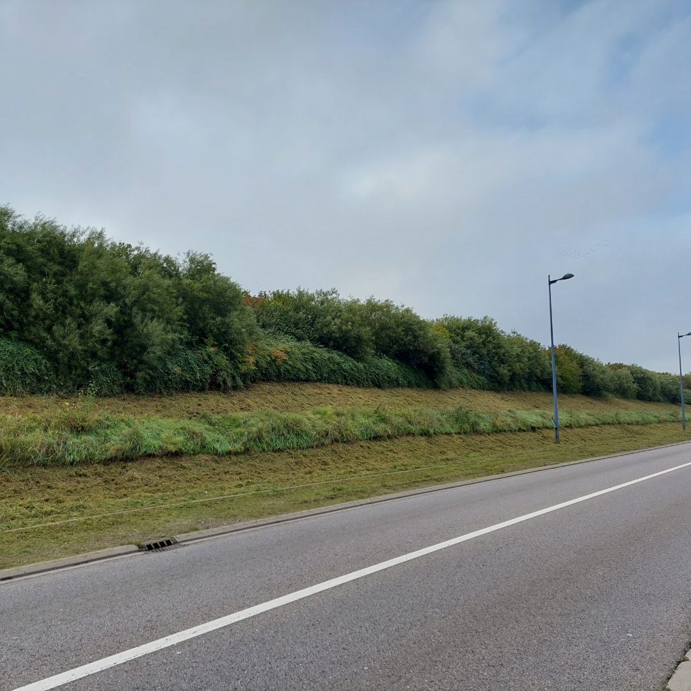

La Métropole du Grand Nancy, en collaboration avec l’Université de Lorraine dans le cadre du projet de recherche SAGID+ expérimente de nouvelles techniques de fauchage des bords de route : le fauchage en damier et le fauchage en bande.

 Fauchage en damier 

 Fauchage en bande 

 

La fin d’année 2025 marque le début de ces expérimentations avec la mise en œuvre de ces nouvelles techniques de fauchage sur deux sites : la M674 entre Tomblaine et Essey et le contournement de Malzéville. 

L’objectif de ces expérimentations est double : étudier l’impact de ces nouvelles pratiques sur la biodiversité présente sur les bords de route, notamment au niveau des insectes pollinisateurs et évaluer l’impact de la mise en place de ces pratiques sur l’organisation générale du fauchage et sur les chantiers.

Ces nouvelles pratiques consistent à ne pas faucher l’ensemble du bord de route chaque année. Certaines zones seront fauchées cette année, les autres seront fauchées l’année prochaine. L’idée est de maintenir des zones refuges pour la biodiversité tout au long de l’année contrairement à un fauchage classique mais aussi de maintenir une continuité dans ces milieux contribuant ainsi à la trame verte. Le fait que chaque zone soit entretenue tous les 2 ans ne permet pas à la végétation de s’installer durablement et permet d’utiliser un matériel d’entretien classique.

Afin d’évaluer l’impact de ce changement de pratique, les bords de route ont été découpées en plusieurs secteurs ou chacune des pratiques sera testée dans des conditions uniformes. En parallèle, des relevés des espèces florales ainsi que des insectes pollinisateurs ont été effectués une fois par mois entre avril et septembre afin de réaliser un état des lieux au niveau de la biodiversité présente en amont du changement de pratique. Une nouvelle étude sera réalisée après plusieurs années afin d’évaluer les changements que la modification des pratiques aurait entraîné.

Retour en vidéo sur l'année 2025:

